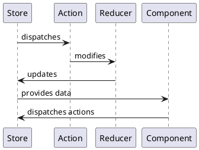

https://app.ultimatecourses.com/course/ngrx-store-effects

---
# Redux Architecture

## Redux Core Concepts

Single State Tree
: Plain JS Object. Composed by reducers.

Actions
: It has 2 props: **type** and **payload**. Type is mandatory.
: It's a **plain JS object**.
: It dispatches actions to reducers through the store.

Reducers
: A **pure function** that **takes the previous state and an action**, and always **returns the next state**.

Store
: State container.
: Consumers can subscribe to the store to get **notified of state changes**.
: We can **dispatch actions** to the store to update the state.
: Store invokes the reducers with the current state and the action to get the next state.

One-way dataflow
: The data flows in a single direction. It makes the app predictable.

---
## Immutable and Mutable JavaScript

Why Immutable?
: Predictability
: Explicit state changes
: Performance (Change detection)
: Mutation tracking
: Undo/Redo state changes

Mutability in JS
: Functions, Objects, Arrays

# Resources

[GitHub - Simple Redux Store](https://github.com/ultimatecourses/redux-store)
_Vanilla TypeScript example of a Redux Store_

[GitHub - NGRX: Store + Effects app](https://github.com/ultimatecourses/ngrx-store-effects-app)